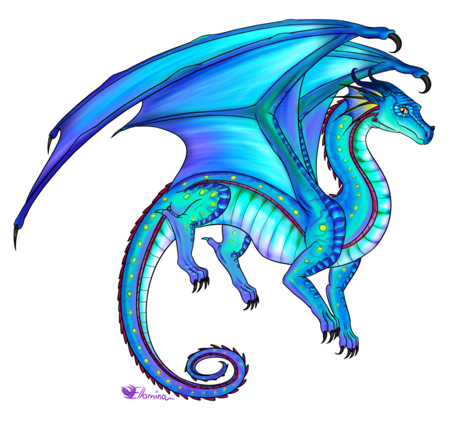
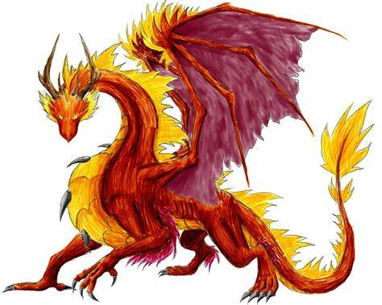
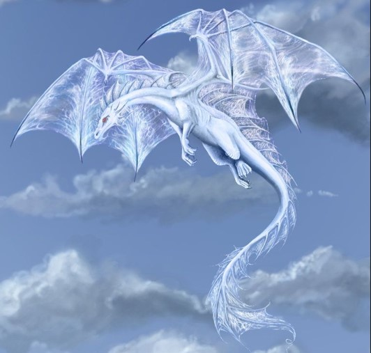
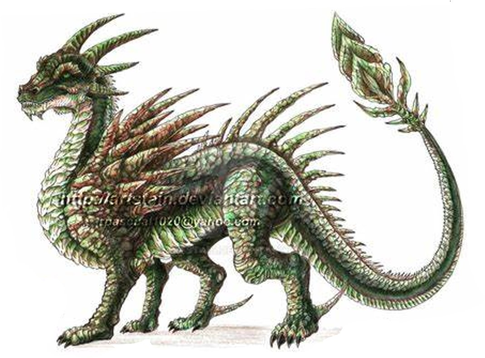
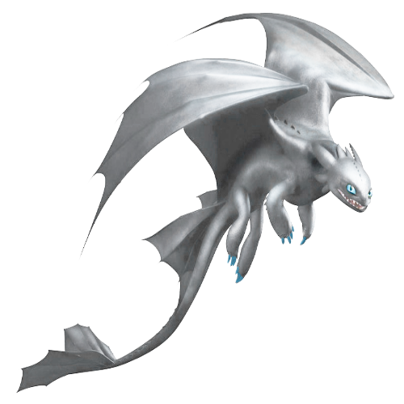
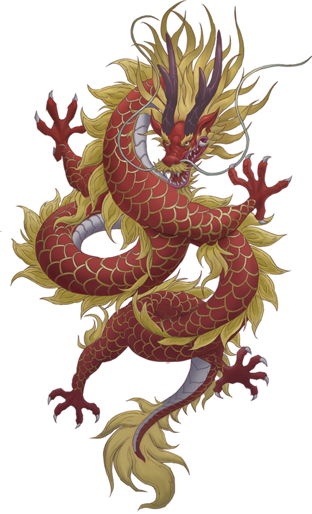

<<<<<<< HEAD
<<<<<<< HEAD
1. Project Name: Dragon Power

2. Project Developers: Павловская Вера Александровна, Мирра Малюгина Михайловна, Молчанов Степан Андреевич

3. Description of the program. 
   При запуске отображается главное окно с сохранённым прогрессом уровней. В начале (на 1 уровне) вы указываете имя и возраст, запускается тест,
   по результатам которого определяется ваша сила из 4 возможных: огонь, вода, воздух, земля.
   Вам дают дракона соответствующей стихии и далее следуют разные уровни боёв и разные режимы.

4. Progress_db - здесь, в базе данных, будут храниться рекорды по разным параметрам.

5. Program code plan:
   a. Переменные:
		   current_level - текущий уровень,
		   cur_level_name - название текущего уровня,
		   cur_race_place - текущее место в гонках,
               my_dragon - ваш дракон по результатам теста
               my_dragon_status - статус вашего дракона (Beginner, Star, Professional, Myth, Legend)
        	   
      Константы:
		   c_db_name - название базы данных,
               fire_dragon - дракон огня (персонаж)
               water_dragon - дракон воды (персонаж)
               air_dragon - дракон воздуха (персонаж)
		   earth_dragon - дракон земли (персонаж)
		   
   b. Функции: start_level - начать уровень,
               choose_game_mode - выбрать режим игры.
               db_update_progress - обновление в бд прогресса
               db_get_info - получение информации из бд
               
               

   c. Классы:  Battle - класс, содержащий информацию боя драконов.
               Enterance_Quiz - содержит тест с вопросами, который нужен для определения стихии
               Dragon_Race - класс, отвечающий за гонки драконов.

   d. Библиотеки: PyGame,
                  PyQt5,
                  Database. 

6. Graphical interface:
   
   
   
   

7. Задача                              Дата
Созданние команд,                    
описание проекта                    05 декабря
Техническое задание (ТЗ)   		    12 декабря
ТЗ + Часть задания выполнена 		19 декабря
Код + Работающая часть проекта 	    26 декабря
Код + Работающая часть + Черновик
пояснительной записки и презентации 09 января
Код + Пояснительная записка +
Презентация + Почти Все работает 	12 января
Все готово 					        16 января

=======
=======
>>>>>>> 75fe536 (up)
1. Project Name: Dragon Power

2. Project Developers: Павловская Вера Александровна, Мирра Малюгина Михайловна, Молчанов Степан Андреевич

3. Description of the program. 
   При запуске отображается главное окно с сохранённым прогрессом уровней. В начале (на 1 уровне) вы указываете имя и возраст, запускается тест,
   по результатам которого определяется ваша сила из 4 возможных: огонь, вода, воздух, земля.
   Вам дают дракона соответствующей стихии и далее следуют разные уровни боёв и разные режимы.

4. Progress_db - здесь, в базе данных, будут храниться рекорды по разным параметрам.

5. Program code plan:
   a. Переменные:
		   current_level - текущий уровень,
		   cur_level_name - название текущего уровня,
		   cur_race_place - текущее место в гонках,
               my_dragon - ваш дракон по результатам теста
               my_dragon_status - статус вашего дракона (Beginner, Star, Professional, Myth, Legend)
        	   
      Константы:
		   c_db_name - название базы данных,
               fire_dragon - дракон огня (персонаж)
               water_dragon - дракон воды (персонаж)
               air_dragon - дракон воздуха (персонаж)
		   earth_dragon - дракон земли (персонаж)
		   
   b. Функции: start_level - начать уровень,
               choose_game_mode - выбрать режим игры.
               db_update_progress - обновление в бд прогресса
               db_get_info - получение информации из бд
               
               

   c. Классы:  Battle - класс, содержащий информацию боя драконов.
               Enterance_Quiz - содержит тест с вопросами, который нужен для определения стихии
               Dragon_Race - класс, отвечающий за гонки драконов.

   d. Библиотеки: PyGame,
                  PyQt5,
                  Database. 

6. Graphical interface:
   
   
   
   

7. Задача                              Дата
Созданние команд,                    
описание проекта                    05 декабря
Техническое задание (ТЗ)   		    12 декабря
ТЗ + Часть задания выполнена 		19 декабря
Код + Работающая часть проекта 	    26 декабря
Код + Работающая часть + Черновик
пояснительной записки и презентации 09 января
Код + Пояснительная записка +
Презентация + Почти Все работает 	12 января
Все готово 					        16 января

<<<<<<< HEAD
>>>>>>> 75fe536 (up)
=======
>>>>>>> 75fe536 (up)
